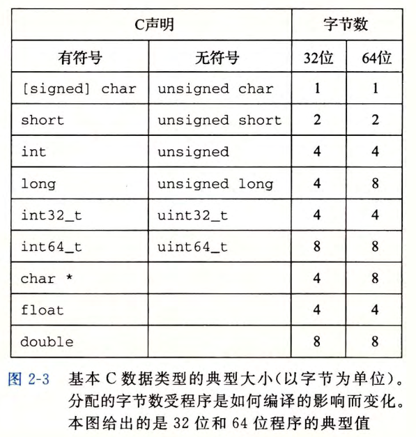
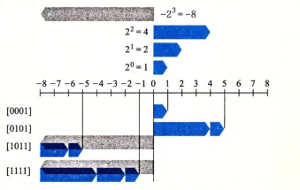

# 学习笔记 - 深入理解计算机操作系统

根据[学习计算机基础有什么推荐的书？ | 小林coding](https://xiaolincoding.com/cs_learn/cs_learn.html#二、计算机组成原理) 推荐，通过[2015 CMU 15-213 CSAPP 深入理解计算机系统 课程视频_哔哩哔哩_bilibili](https://www.bilibili.com/video/BV1iW411d7hd/?vd_source=d9a247b832223a96fd8f8be6c1412759)学习一下。

## Chapter 2

字数据大小

> 每台计算机都有一个字长 (word size), 指明指针数据的标称大小 (nominal size) 。因为
> 虚拟地址是以这样的一个字来编码的，所以字长决定的最重要的系统参数就是虚拟地址空
> 间的最大大小。

一个计算机的字长，决定的其虚拟地址的范围。原来的32位的机器扩展到当前的64位，则虚拟地址从4GB扩展到当前的16EB。

当然，64位的机器可以运行32位机器编译的程序，这是向后兼容的。

无符号数计算公式：$ B2U(X) = \sum\limits_{i=0}^{w-1}x_{i}\cdot2^{i} $

符号数计算公式：$ B2T(X) = -x_{w-1}\cdot2^{w-1}+\sum\limits_{i=0}^{w-2}x_{i}\cdot2^{i} $

 

> 某些机器选择在内存中按照从最低有效字节到最高有效字节的顺序存储对象，而另一些机器则按照从最高有效字节到最低有效字节的顺序存储。前一种规则——最低有效字节在最前面的方式，称为小端法 (little endian) 。后一种规则 —-—最高有效字节在最前面的 方式，称为大端法 (big endian) 。大 多 数 Int e l 兼容机都只用小端模式 。一旦选择特定的操作系统，那么字节顺序也就固定下来了。

​	一般情况下，机器所使用的字节顺序是完全不可见的，但是在网络传送二进制数据时，相同的数据被大端法和小端法获取到的结果是不同的，所以在网络应用程序的代码中必须遵守已建立的关于字节顺序的规则，以确保发送方机器将它的内部表示转换成网络标准，而接收方机器则将网络标准转换为它的内部表示。

整数表示

1. 无符号数的编码
2. 补码编码
   1. 补码编码具有唯一性。
   
   2. 介绍
   
      1. 正数的补码是自身，负数的补码是符号位不变，其他位反转，最后再加1；
      2. 符号位的权重，决定了起始位置，当其为负数时，其起始点在最左端，否则为0，然后依次求和其他位，最终的位置则是补码。这样可以看到正数的补码在右侧，而负数的补码则在左侧。具体如下图所示，其中灰色的左侧为其起始位置。
   
      
   
   3. Java标准要求采用补码表示整数数据类型。在Java中，单字节数据类型为byte。

3. 关于有符号数与无符号数的建议

   有符号数到无符号数的隐式转换会导致错误或者漏洞。避免这类错误的一个方法就是绝不使用无符号数。

   

